# TOTO Number Analysis 🎯
A data analysis project exploring number frequency, patterns, and trends in Singapore TOTO lottery draws using Python. This project aims to gain insights from historical TOTO results through statistical techniques and data visualization.

---

## 📊 Project Overview
The goal of this project is to explore whether there is a smarter way to select our TOTO numbers that would give us a statistical advantage over just randomly selecting them.
We will be doing this through:
- Analysing the frequency of winning numbers.
- Visualising trends over time.
- Identifying number distribution and repetition patterns.
- Exploring and evaluating basic prediction strategies.

---

## 🧰 Tech Stack
- **Language**:
    - Python 3

- **Libraries**:
    - Pandas (For data manipulation and cleaning)
    - Matplotlib / Seaborn (For visualizing frequency and trends)
    - SciPy (For statistical calculations)

---

## 📁 Project Structure
```
toto-number-analysis/
├── toto_results.csv    # Historical TOTO draw data (input)
├── toto_analysis.py    # Main script with menu and analysis functions
├── README.md           # Project documentation
└── requirements.txt    # Python package dependencies
```

---

## ▶️ How to Use
1. **Clone the repository**:
    ```bash
    git clone https://github.com/cyuanjun/toto-number-analysis.git
    ```

2. **Change directory**:
    ```bash
    cd toto-number-analysis
    ```

3. **Create/Activate virtual environment (Optional)**:
    
    - #### Windows:
        - Creating virtual environment
        ```bash
        python -m venv toto_number_analysis_venv
        ```

        - Activating virtual environment
        ```
        toto_number_analysis\Scripts\activate
        ```
    - #### Mac:
        - Creating virtual environment
        ```bash
        python3 -m venv toto_number_analysis
        ```

        - Activating virtual environment
        ```
        source toto_number_analysis/bin/activate
        ```

    - #### Deactivating virtual environment (Windows/Mac)
        - Same for Windows / Mac
        ```bash
        deactivate
        ```

4. **Install necessary libraries from requirements.txt file into virtual environment**:
    ```bash
    pip install -r requirements.txt
    ```

5. **Running the script**:
    ```bash
    python toto_analysis.py
    ```

6. **Navigate with command-line-interface**:
    - Select the option that you want by typing into the command-line
    ```
    What data do you want to look at?
    1. Individual bar chart
    2. Grouped bar chart
    3. Overall frequency
    4. Backtest (Most Frequent)
    5. Backtest (Least Frequent)
    6. Confidence interval chart
    7. Monte carlo
    0. End
    ===========================
    Choice:
    ```

---
## ℹ️ 0. Information
- **Winning numbers** will be represented by:
    - Num1 - Num6 (Sorted in ascending order)
- **Additional number** will be represented by:
    - Num7

---

## 🧾 1. Getting Dataset
- For this project, I will be using data from a csv file downloaded from [this](https://en.lottolyzer.com/history/singapore/toto/page/1/per-page/50/summary-view)
 website, which contains past TOTO draw data starting from 2008.
 - To get the latest dataset, click on the CSV icon above the table on the left side and complete the capcha to download the file.

 
 - Ensure that the downloaded csv file is placed in the **"toto-number-analysis"** folder that you have cloned, and rename it to **"toto_results.csv"**.

---

## 🧹 2. Loading / Cleaning Data
- **2.1 Loading Data** - *cleandata.load_data() functon*
    - To load data from the csv file, we will be using the ***"read_csv()"*** function within a ***"try except"*** block.
    - This allows us to catch potential errors such as:
        - ***FileNotFoundError*** - No file with that name is found
        - ***KeyError*** - Missing column

- **2.2 Cleaning Data** - *clean_data.clean_data() function*
    - "Garbage in garbage out". Since we are using data from a third party and we do not know whether the data is clean or not, we have to clean the data to prevent bugs and ensure accuracy. To do so, we first have to identify what are some parameters the data has to satisfy.
    - For this dataset, we need to check for:
        - ***Missing values*** 
            - All TOTO draws have 6 numbers and 1 additional number
        - ***Incorrect data type***
            - All data should be integers
        - ***Range of values (Values have to be between 1 and 49)***
            - All values have to be between 1 and 49
        - ***Duplicate values in the same row***
            - The same number cannot appear twice in one draw
        - ***Order of values for Num1 - Num6***
            - Facilitates use of data later when performing analysis

---

## 📈 3. Data Analysis (Actual Past Data)
- **3.1 Invividual Frequency Bar Chart** - *toto_analysis.individual_bar_chart()*
    - We first start by plotting the frequencies of Num1 - Num7 on a bar chart to see if there are any patterns.
        - **3.1.1 Num1 Frequency**
        
        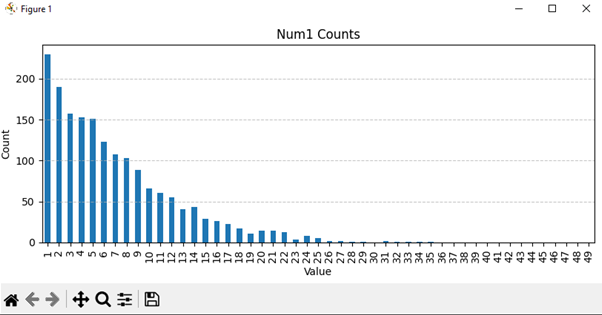

        - **3.1.2 Num2 Frequency**

        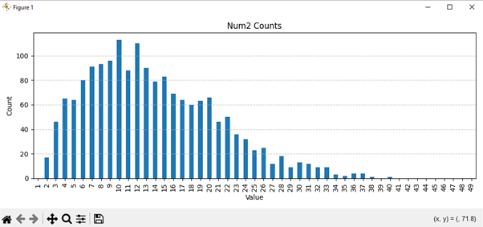

        - **3.1.3 Num3 Frequency**

        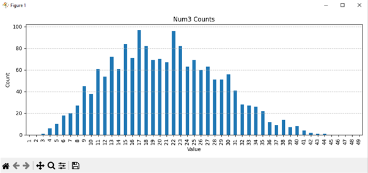

        - **3.1.4 Num4 Frequency**

        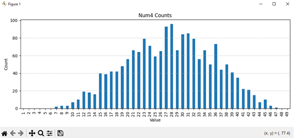

        - **3.1.5 Num5 Frequency**

        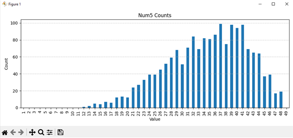

        - **3.1.6 Num6 Frequency**

        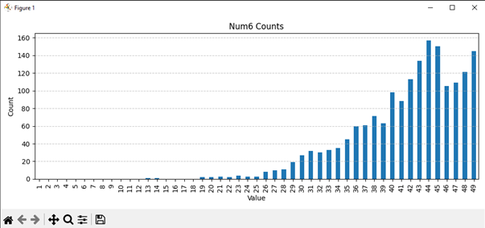

        - **3.1.7 Num7 Frequency**
        
        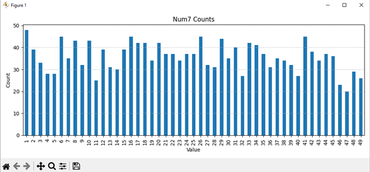

    - From these bar graphs, we can see that in general, apart from some noise from having a low sample size, Num1 and Num2 are right skewed, Num3 and Num4 are normally distributed, and Num5 and Num6 are left skewed. This makes sense as the numbers are sorted in ascending order, and so earlier numbers tend to be smaller, and later numbers tend to be bigger. This is more of an artifact from sorting the numbers and not a bias in how the numbers are drawn. This, however, gives us an idea of how results are structured, which is still valuable information. 

- **3.2 Grouped Frequency Bar Chart** - *toto_analysis.grouped_bar_chart()*
    - We then plot the frequencies of Num1 - Num6 on a bar chart to see if there are any patterns.
        
    
    
    - Again, this is more useful for showing how the draw results are structured.

- **3.3 Overall Frequency Bar Chart** - *toto_analysis.overerall_frequency_chart()*
    - Next, we plot the overall frequencies of Num1 - Num7 on a bar chart to see if there are any patterns.
        
    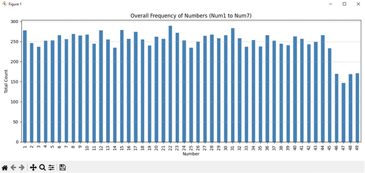
    
    - From the bar chart, we can see that the numbers generally appear the same number of times, except for 46-49, which could indicate a bias, or just not having enough cases, and is worth exploring more.

- **3.4 Confidence Interval** - *toto_analysis.confidence_interval()*
    - The next thing we can do is to calculate the confidence interval of the various numbers. We will be using 95% confidence interval in this case.

        - **3.4.1 Num1 Confidence Interval**
            
        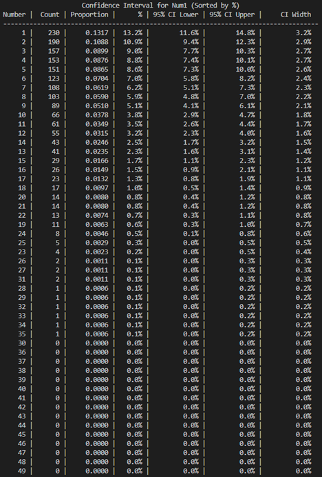

        - **3.4.2 Num2 Confidence Interval**

        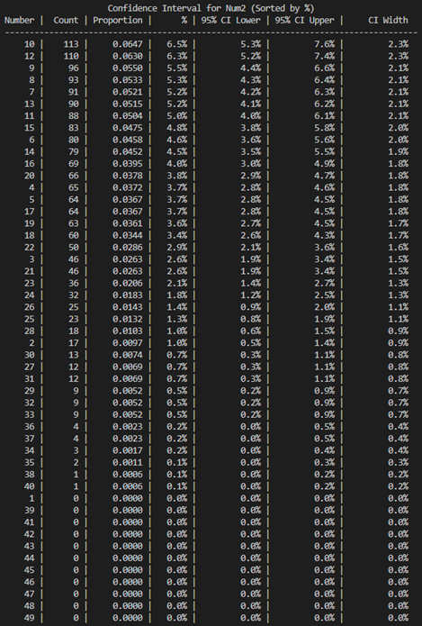

        - **3.4.3 Num3 Confidence Interval**

        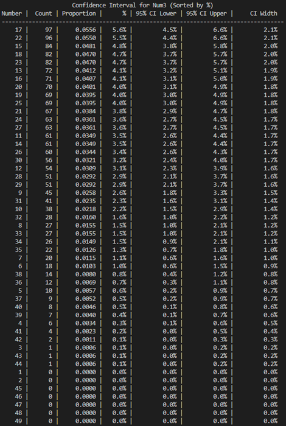

        - **3.4.4 Num4 Confidence Interval**

        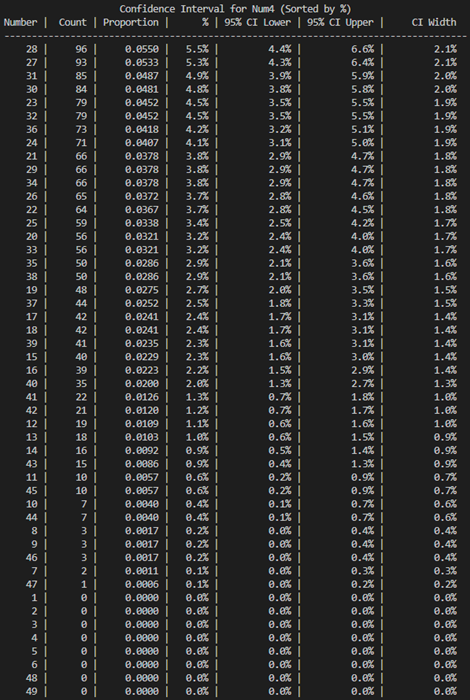

        - **3.4.5 Num5 Confidence Interval**

        

        - **3.4.6 Num6 Confidence Interval**

        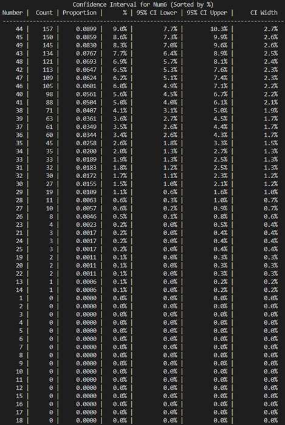

        - **3.4.7 Num7 Confidence Interval**
        
        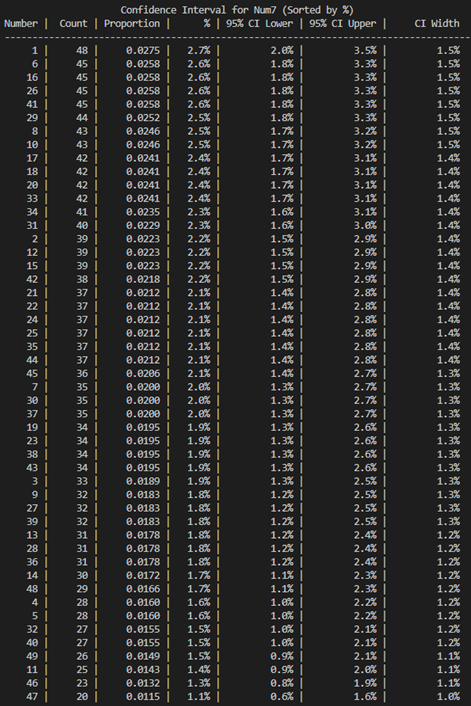

    - addd desc ltr

---

## 📈 4. Data Analysis (Monte Carlo Simulation)
- **4.1 Simulated Invividual Frequency Bar Chart** - *toto_analysis.individual_bar_chart()*
    - As we only have access to a small sample size of data (1746 draws), fluctuations could be cause by pure randomness as some numbers may just appear more or less often by chance. To solve this, we will be using Monte Carlo Simulation to generate a large random sample that models the behaviour of TOTO draws. This will allow us to establish a baseline for expected frequencies, which we can then compare against our data. We have chosen to generate a dataset of size 100000 in order to smooth out randomness and reveal clearer frequency trends.
    -  To do so, we first generate 6 random numbers from 1-49 and sort them in ascending order, then select an additional number from 1-49 that is not any of the other numbers.

        - **4.1.1 Num1 Simulated Frequency**
        
        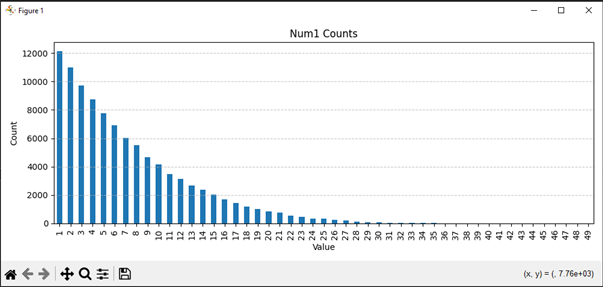

        - **4.1.2 Num2 Simulated Frequency**

        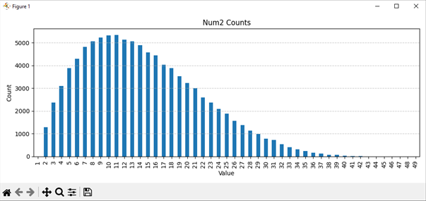

        - **4.1.3 Num3 Simulated requency**

        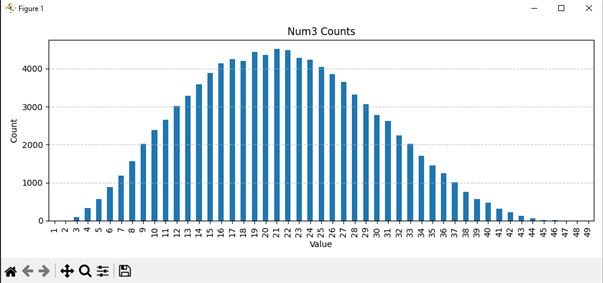

        - **4.1.4 Num4 Simulated Frequency**

        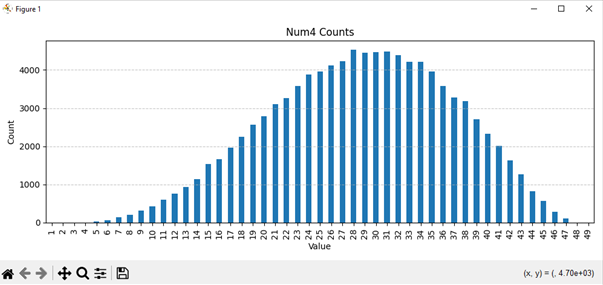

        - **4.1.5 Num5 Simulated Frequency**

        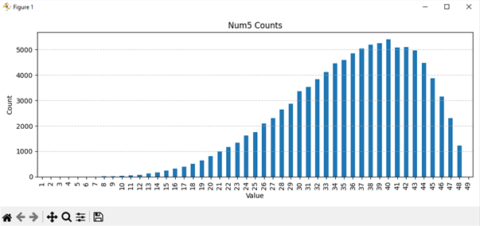

        - **4.1.6 Num6 Simulated Frequency**

        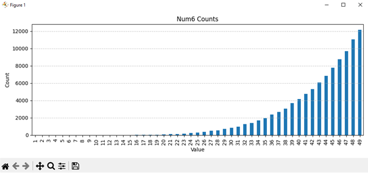

        - **4.1.7 Num7 Simulated Frequency**
        
        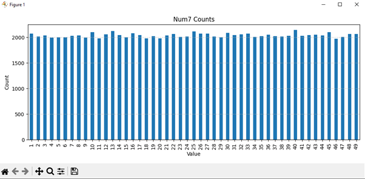

    - By using a larger sample size, we can see that the graphs smooths out alot more as the there is lesser noise from randomness due to having a small sample size.
    - Comparing with our graph of actual draws, we can see that it follows the same general pattern, which means there is no bias towards or against certain numbers.
    - This shows that there is no significant deviation from what would be expected from random and fair lottery conditions based on Monte Carlo simulation results.

- **4.2 Grouped Frequency Bar Chart** - *toto_analysis.grouped_bar_chart()*
        
    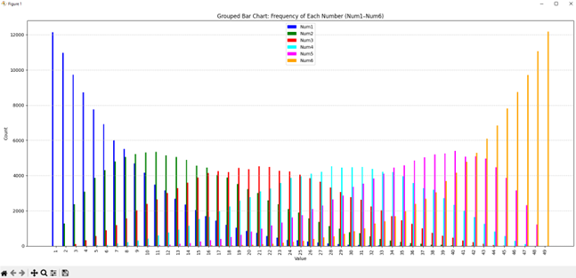
    
    - addd desc ltr

- **4.3 Overall Frequency Bar Chart** - *toto_analysis.overerall_frequency_chart()*
        
    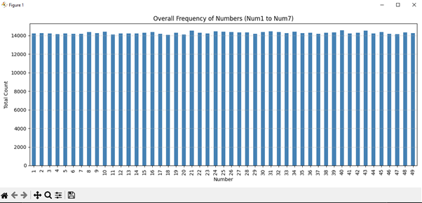
    
    - From the bar chart, we can see that the numbers generally appear the same number of times unlike the chart from actual data, that has lesser counts of 46-49. This shows that it is most likely a result of having too small of a sample size.

- **4.4 Confidence Interval**   - *toto_analysis.confidence_interval()*
    - The next thing we can do is to calculate the confidence interval of the various numbers. We will be using 95% confidence interval in this case.

        - **4.4.1 Num1 Confidence Interval**
            
        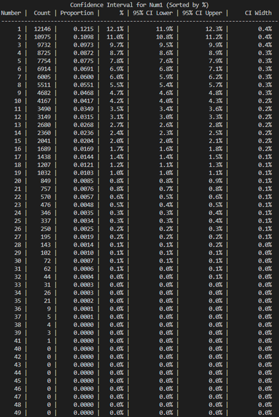

        - **4.4.2 Num2 Confidence Interval**

        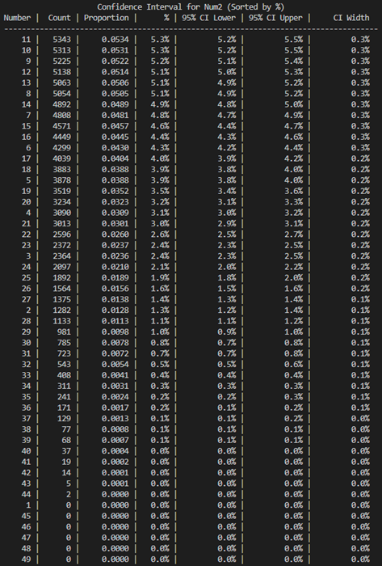

        - **4.4.3 Num3 Confidence Interval**

        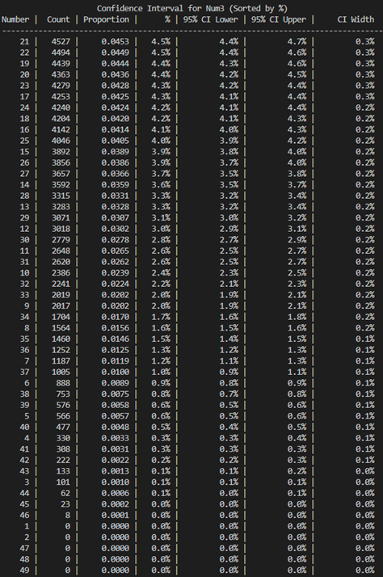

        - **4.4.4 Num4 Confidence Interval**

        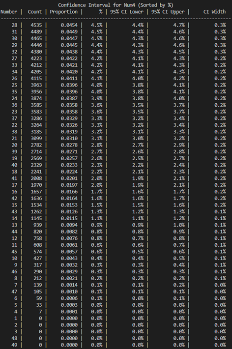

        - **4.4.5 Num5 Confidence Interval**

        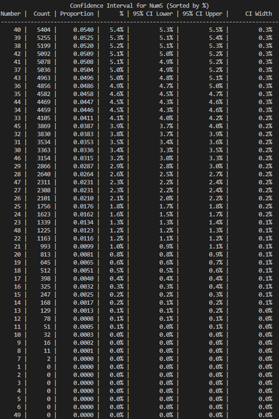

        - **4.4.6 Num6 Confidence Interval**

        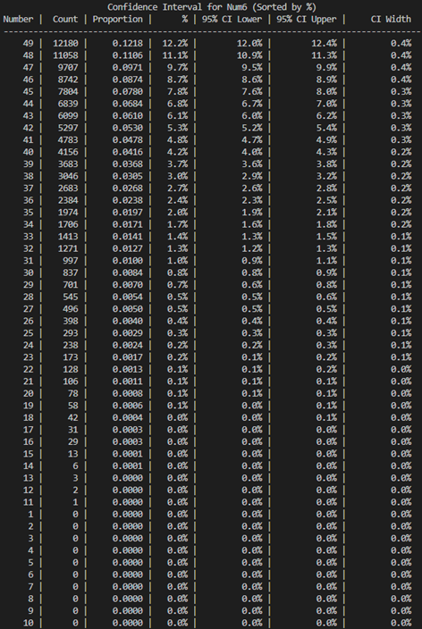

        - **4.4.7 Num7 Confidence Interval**
        
        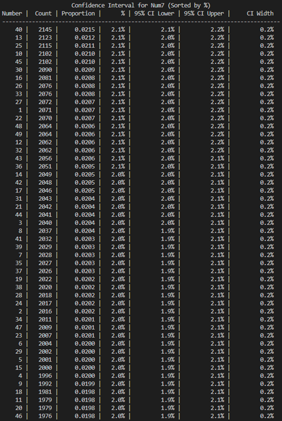

    - addd desc ltr

---

## 📈 5. 
- **5.1 Simulated**


## -
## -
## -
## -
## -
## -
## -
## -
## -
## -
## -
## -
## -
## -


